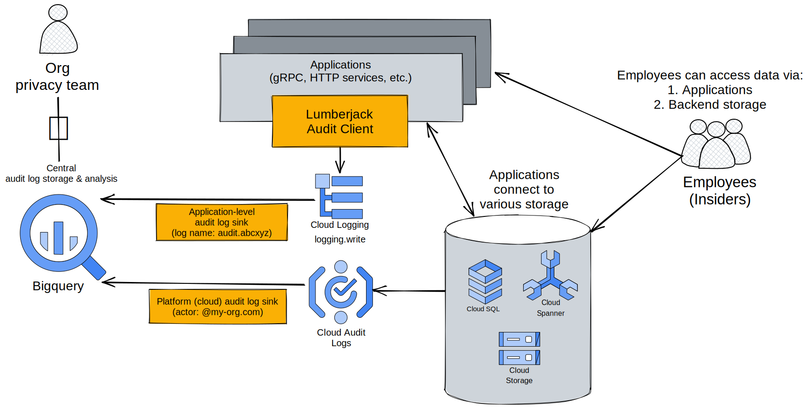

# Lumberjack

**Lumberjack is not an official Google product.**

Lumberjack helps your applications on Google Cloud to write audit logs similar
to Cloud Audit Logs and provides building blocks to centrally collect the audit
logs for analysis.

## Use Case

Audit logs are special logs that record **when** and **who** called **which**
application and accessed **what** data. And **why** the access was necessary.

The typical use case of Lumberjack is for an organization's
[insider risk (or insider threat)](https://en.wikipedia.org/wiki/Insider_threat)
program. The organization will require its applications to write audit logs
whenever there are **employees** calling the applications to access **user
data**.

## Architecture



Data access could happen on two routes:

*   Via applications that connect to data storage. We can audit logs from such
    accesses **application-level audit logs**. Lumberjack provides
    [Go](./clients/go) and [Java](./clients/java-logger) SDK to help write
    application-level audit logs via cloud logging. Find out
    [more about how to use the SDK](./docs/clients.md). It also provides a
    [CLI](./docs/cli.md) tool for log validation, which can be used as a
    debugging tool or if you write logs through other means but want to use the
    same logging standards.
*   Directly via data storage API. Google Cloud provides
    [Cloud Audit Logs](https://cloud.google.com/logging/docs/audit) to capture
    such accesses. We also call these logs **platform-level audit logs** to
    differentiate from application-level audit logs.

For **application-level audit logs**, Lumberjack reuses the Google Cloud's
[AuditLog](https://github.com/googleapis/googleapis/blob/master/google/cloud/audit/audit_log.proto)
format in
[LogEntry's JSON payload](https://github.com/googleapis/googleapis/blob/04d2494feb6f549c8dc5c37be753e76ef32b4e07/google/logging/v2/log_entry.proto#L97).

Both application-level and platform-level audit logs should be routed via [log
sinks](https://cloud.google.com/logging/docs/export/configure_export_v2) to a
central audit log storage. We recommend using BigQuery as the central audit log
storage. See [the log sink filters](./terraform/static/).

## Audit Logging in gRPC

Lumberjack SDK provides near-automated audit logging for gRPC services via gRPC
interceptor. Find out more [here](./docs/grpc.md).

## Ingestion Service

By default, we recommend having Lumberjack SDK to write application-level audit
logs to cloud logging. In case you prefer having a central log ingestion
service, Lumberjack also provides a
[sample log ingestion service](./cmd/server/main.go). Lumberjack SDK can be
configured to write application-level audit logs to the ingestion service via
[a gRPC API](./protos/v1alpha1/audit_log_agent.proto) instead. A central
ingestion service could come in handy when you need to add common audit log
processing logic.

## Other Kinds of Audit Logging

The audit logging described above is the typical **user data access** audit
logging. Lumberjack could also help with other kinds of audit logging:

*   **Consent Events**: Audit logging user consent events (agreement and
    revocation). The request principal in such logs should be the user who's
    approving/revoking the consent agreement.
*   **System Events**: Audit logging system produced events, e.g. GitHub
    workflow requesting GitHub token with elevated permissions. The request
    principal in such logs should be the system identity making the request.

See [supported log types here](./protos/v1alpha1/audit_log_request.proto).

## Installation

### Via abc CLI
You can leverage [abc CLI](https://github.com/abcxyz/abc#abc) to set up the basic infrastructure
needed for this service.
You will need to install [abc CLI](https://github.com/abcxyz/abc#abc)
by following docs [here](https://github.com/abcxyz/abc#installation).

You can customize to create the [log
sinks](https://cloud.google.com/logging/docs/export/configure_export_v2) 
either in GCP projects, folders or organization. Below is the example of create the
[log sinks](https://cloud.google.com/logging/docs/export/configure_export_v2)
in GCP projects.

```sh
abc templates render \
 -input='project_id=<YOUR_PROJECT_ID>' \
 -input='lumberjack_release_version=<YOUR_LUMBERJACK_RELEASE_VERSION>' \
 -input='log_sink_project_ids=[<YOUR_LOG_SINK_PROJECT_ID>,......]' \
 -input='application_audit_logs_filter_file=<YOUR_APPLICATION_AUDIT_LOGS_FILTER_FILE>' \
 -input='cloud_audit_logs_filter_file=<YOUR_CLOUD_AUDIT_LOGS_FILTER_FILE>' \
 -input='terraform_state_bucket=<YOUR_TERRAFORM_STATE_BUCKET>' \
 -input='terraform_state_prefix=<YOUR_TERRAFORM_STATE_PREFIX>' \
 github.com/abcxyz/jvs.git//templates/lumberjack-e2e
```
